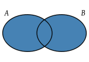
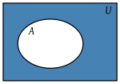

# Referencias

- (Partee, *et al.*, 1990, chap. 1) [^partee]

- Wikipedia: Conjunto [^conjunto]

- Wikipedia: Álgebra de conjuntos [^algebra]

# Conjuntos

Un **conjunto** es una colección de objetos distintos llamados *miembros* o *elementos* de ese conjunto. Un conjunto puede contener objetos de diferente naturaleza\marginnote{bicicletas, neuronas, canicas, cuadros de Velázquez}, tanto elementos concretos como abstractos\marginnote{manzanas, el fonema /m/, los sueños tristes}; incluso objetos que no tengan nada en común salvo la pertenencia al conjunto en cuestión.

Los conjuntos pueden ser grandes\marginnote{los habitantes de Tokio} o pequeños;\marginnote{los alumnos de esta clase} pueden ser finitos\marginnote{los días de la semana} o infinitos;\marginnote{las oraciones en español, los enteros múltiplos de 2}. 

Como los elementos miembros de los conjuntos pueden ser objetos abstractos, un determindo conjunto puede ser a su vez elemento de otro conjunto y tener, simultáneamente, otros conjuntos como miembros.

Todas estas características convierten a la Teoría de Conjuntos en una herramienta muy poderosa para realizar análisis matemáticos, sí, pero también lingüísticos.	

Un\marginnote{El conjunto de las estrellas de la Vía Láctea o el conjunto de los reyes godos están perfectamente bien definidos aunque seamos incapaces de enumerar todos sus miembros.} conjunto puede estar bien definido y ser considerado un objetivo perfectamente legítimo aunque seamos incapaces de conocer todos sus miembros.

Para\marginnote{Todos tenemos claros el tipo de objetos que podrían ser elementos del conjunto formado por los elementos de color rojo, aunque podamos discutir las sutiles diferencias que encontramos entre las distintas gamas del color rojo, del color naranja, etc.} que un conjunto esté bien definido basta que que estén claras, en principio, las propiedades que tienen que poseer sus elementos para ser considerados miembros.

## Tipos especiales de conjuntos

- Un conjunto con un único miembro se conoce con el nombre de **conjunto unitario** o *singleton*.

- Otro tipo de conjunto especial es el **conjunto vacío**, que no tienen ningún miembro.\marginnote{Esta idea de conjunto vacío es el concepto que nos permite representar, p. ej., el conjunto de los círculos cuadrados o el conjuntos de los objetos que no son idénticos a sí mismos. Se trata de una convención matemática que nos permite generalizar otras ideas sobre cualquier tipo de conjuntos.}

## Convenciones de notación en Teoría de Conjuntos

- Los conjuntos se nombran con letras mayúsculas: $A, B, C\ldots$

- Los miembros o elementos de los conjuntos se nombran con letras minúsculas: $a, b, c\ldots$ ó $x, y, z\ldots$

- La relación de pertenencia a un conjunto se escribe con un símbolo especial $\in$, de manera que $b \in A$ se lee *b es miembro de A*, *b pertenece a A* o *A contiene b*.

- La negación de la relación de pertenencia se escribe $\notin$, de manera que $b \notin A$ se lee *b no es miembro de A*, *b no pertenece a A* o *A no contiene b*.

- Como los conjuntos pueden ser miembros de otros conjuntos, es habitual escribir $A \in B$ para indicar que *A es miembro de B*, sin respetar la convención de escribir los nombres de los elementos en minúsculas.

## Especificación de conjuntos

Existen tres maneras posibles de especificar un conjunto:

1. enumerando todos y cada uno de sus miembros: **extensión**.

2. especificando una propiedad que un objeto debe poseer para ser considerado un miembro de dicho conjunto: **intensión**

3. definiendo un conjunto de reglas que generen a sus miembros: **reglas recursivas**

**Extensión**

Cuando los conjuntos son finitos y sus miembros pueden enumerarse uno detrás de otro de manera sencilla, es habitual especificar el conjunto de manera **extensional** o en **forma de lista**. Para especificar un conjunto de manera extensional simplemente encerramos entre llaves los nombres de sus miembros, y los separamos con comas. El conjunto formado por el río más largo de la Tierra, el actual presidente del Gobierno de España y el número tres puede especificarse de la siguiente manera: 

$\{$el río Amazonas, Mariano Rajoy, 3$\}$

Nótese que cuando especificamos un conjunto de esta manera, los miembros del conjunto son los objetos, las realidades nombradas, no los nombres. De manera que una forma alternativa de especificar el mismo conjunto sería:
	
$\{$el río Amazonas, el actual presidente del Gobierno de España, 3$\}$

Cuando queremos especificar que el elemento del conjunto es el nombre en sí y no la entidad a la que hace referencia, es habitual utilizar comillas simples: 

$\{$el río Amazonas, `Mariano Rajoy', 3$\}$

Contrariamente a lo que podamos pensar, no hay ningún tipo de orden en los elementos de un conjunto. Nuestra sistema de escritura nos obliga a presentar los elementos de una lista de izquierda a derecha, pero en la especificación de este conjunto no existe un primer elemento, ni un segundo ni un tercero. 

$\{$3, el río Amazonas, Mariano Rajoy$\}$ es el mismo conjunto.

Al especificar por extensión un determinado conjunto, el hecho de escribir uno de los elementos más de una vez no modifica su estatus de miembro del conjunto.\marginnote{La pertencia a un conjunto no es nunca cualidad gradual sino absoluta: o se es miembro o no se es. No existen elementos más miembros que otros.}

$\{a, b, c, d, e, e, e\} = \{a, b, c, d, e\}$

Para conjuntos finitos pero muy grandes, este tipo de notación es poco práctica y es habitual abreviarla siempre que sea posible reconocer el patrón.

$\{5, 10, 15, \ldots 90, 95, 100\}$

**Intensión**

Cuando el conjunto que queremos describir es infinito o finito pero muy grande, es más cómodo especificar el conjunto indicando una propiedad que todos los elementos del conjunto comparten. Este tipo de descripción recibe el nombre de **definición intensiva** o **comprensión** y se especifica:

$\{$x $|$ x es un número par mayor que 3$\}$, que se lee *el conjunto de todos los x tal que x es un número par mayor que 3*
 
En este ejemplo, $x$ es una variable, es decir un símbolo auxiliar que no representa ningún objeto en concreto, sino cualquiera que cumpla la condición indicada en la especificación.\marginnote{Nótese que dos predicados distintos pueden especificar el mismo conjunto, p. ej.: $\{$x $|$ x es un número divisible entre 2 y mayor o igual que cuatro$\}$}
 

**Reglas recursivas**

Es posible especificar conjuntos infinitos mediante la formulación de reglas recursivas que permitan generar los elementos del conjunto. P. ej., el conjunto infinito $E = \{4, 6, 8, \ldots\}$ puede generarse con las siguientes reglas:

a. $4 \in E$
b. Si $x \in E$, entonces $x+2 \in E$.

Este tipo de especificaciones siempre contienen una declaración explícita de un miembro (a veces varios) que pertenece al conjunto (caso base); y, un número finito de reglas de tipo SI-ENTONCES (*IF-THEN*) que permiten generar, a partir del caso base, infinitos elementos que pertenecen al conjunto.
	

## Identidad

Dos conjuntos son **idénticos** si y solo si tienen exactamente los mismos miembros. Por el momento, hemos visto que diferentes descripciones extensionales o intensionales pueden especificar el mismo conjunto.

Podemos perfectamente utilizar el signo igual $=$ para indicar que dos especificaciones describen el mismo conjunto: $\{1, 2, 3, 4, 5, 6\} = \{$x $|$ x es un entero positivo menor de 7$\}$	

Como hemos visto, el signo igual $=$ se puede utilizar en dos contextos diferentes.

- Para declarar explícitamente un conjunto: *sea $A = \{1, 2, 3\}$*

- Para afirmar que dos conjuntos previamente especificados son idénticos: $\{1, 2, 3, 4, 5, 6\} = \{$x $|$ x es un entero positivo menor de 7$\}$	

El **conjunto vacío**, por el contrario, es único. 

- Su identidad está determinada por la ausencia de miembros.

- El conjunto formado por los círculos cuadrados y el conjuntos de los objetos que no son idénticos a sí mismos son el mismo conjunto.

- El símbolo que representa este conjunto vacío es $\varnothing$

## Cardinalidad

El número de miembros de determindo conjunto $A$ recibe el nombre de **cardinalidad** de $A$, y se escribe $|A|$ o $\#(A)$. La cardinalidad de un conjunto finito es siempre un número entero. \marginnote{P. ej., el conjunto $\{a, b, c\}$ tiene cardinalidad $3$.} 

Dos conjuntos idénticos tienen la misma cardinalidad\marginnote{$\{1, 2, 3, 4, 5, 6\} = \{$x $|$ x es un entero positivo menor de 7$\}$ y ambos tienen cardinalidad $6$.}

Por supuesto, conjuntos distintos pueden tener la misma cardinalidad. Los conjuntos infinitos también tienen cardinalidad, pero no son números naturales. 

## Subconjuntos

Cuando tenemos dos conjuntos $A$ y $B$, y todos y cada uno de los miembros de $A$ son también miembros de $B$, decimos que $A$ es un **subconjunto** de $B$.

Denotamos\marginnote{Algunos ejemplos de subconjuntos:

\begin{itemize}
\item $\{a, b, c\} \subseteq \{a, r, s, b, c, e, 1\}$
\item $\{a, b, w\} \not\subseteq \{a, r, s, b, c, e, 1\}$
\item $\{a, b, c\} \subset \{a, r, s, b, c, e, 1\}$
\item $\varnothing \subset \{a\}$
\item $\{a, \{a\}\} \subseteq \{a, b, \{a\}\}$
\item $\{\{a\}\} \not\subseteq \{a\}$
\item $\{a\} \not\subseteq \{\{a\}\}$, pero $\{a\} \in \{\{a\}\}$
\end{itemize}
} esta relación con la expresión $A \subseteq B$, que se lee *$A$ es un subconjunto de $B$* ó *$A$ está contenido en $B$*. La misma relación se puede expresar con $B \supseteq A$, que se lee *$B$ es un superconjunto de $A$*. Para expresar la negación de la relación de subconjunto y superconjunto utilizamos respectivamente los símbolos $\not\subseteq$ y $\not\supseteq$

Nótese que $B$ puede contener más elementos no presentes en $A$, pero esta condición no es imprescindible para que $A$ sea subconjunto de $B$.De esta idea se deriva que todo conjunto es, a la vez, subconjunto de sí mismo: $A \subseteq A$. Si queremos excluir explícitamente esta posibilidad, podemos utilizar la noción de **subconjunto propio**, que se expresa $A \subset B$, lo que implica que $A \not= B$

Tanto los **miembros** de un conjunto como los **subconjuntos** representan relaciones del tipo *parte de un todo*. Sin embargo, se trata de relaciones diferentes, y es conveniente no confundirlas. Los subconjuntos son siempre conjuntos, mientras que los miembros pueden serlo o no. 

Marte es un elemento del conjunto $\{$Tierra, Venus, Marte$\}$, pero no es un subconjunto. El conjunto formado por un único elemento $\{$Marte$\}$ sí es un subconjunto de $\{$Tierra, Venus, Marte$\}$. Es importante distinguir el elemento Marte del conjunto formado por el elemento Marte, que especificamos $\{$Marte$\}$.

El conjunto $A = \{b, \{c\}\}$ tiene dos elementos: $b$ y $\{c\}$.

Teniendo en cuenta lo visto hasta el momento, $b \not\subseteq A$, pero $\{b\} \subseteq A$.

De manera similar, $\{c\} \not\subseteq A$, porque $c$ no es un miembro de $A$.

Pero $\{\{c\}\} \subseteq A$, porque todos y cada unos de los miembros de $\{\{c\}\}$, es decir $\{c\}$, sí son elementos de $A$.

## Conjunto potencia

A veces necesitamos referirnos al conjunto cuyos miembros son todos y cada uno de los subconjuntos de un determinado conjunto $A$. Esta noción recibe el nombre de **conjunto potencia**\marginnote{El nombre conjunto potencia proviene del hecho de que si la cardinalidad de $A$ es un número natural $n$, entonces $|\wp(A)| = 2^n$, es decir, $2 x 2 x 2\ldots$ y así hasta $n$ veces.} de $A$, y se escribe $\wp(A)$ ó $P(A)$. Supongamos que $A = \{a, b\}$, entonces el conjunto potencia de A $\wp(A) = \{\{a\}, \{b\}, \{a, b\}, \varnothing\}$.

# Álgebra de conjuntos

Hay varias operaciones que podemos realizar sobre conjuntos, tomando como entrada un par de conjuntos y generando como salida un tercer conjunto.\marginnote{Existe un método muy sencillo para representar visualmente operaciones de álgebra de conjuntos llámado **diagramas de Venn**. Cada conjunto se representa como una circunferencia y los miembros se representan como puntos dentro de ella.

\includegraphics[scale=0.3]{../img/DosConjuntos.png} 
}

## Unión

La **unión** de dos conjuntos $A$ y $B$, escrito $A \cup B$, es el conjunto resultante formado por todos los miembros de $A$, de $B$ o de ambos.

La definición intensional de la unión es: 

$A \cup B = \{x |$ o bien $x \in A$ o bien $x \in B\}$

## Intersección

La **intersección** de dos conjuntos $A$ y $B$, escrito $A \cap B$, es el conjunto resultante formado únicamente por los miembros de $A$ que también lo son de $B$.

La definición intensional de la intersección es: 

$A \cap B = \{x | x \in A$ y $x \in B\}$

## Diferencia

La **diferencia**\marginnote{Si $A$ y $B$ no tienen nada en común, entonces $A - B = A$. A pesar de que $A \cup B = B \cup A$, y de que $A \cap B = B \cap A$, no siempre es cierto que $A - B$ sea lo mismo que $B - A$.} de dos conjuntos $A$ y $B$, escrito $A - B$, es el conjunto resultante de sustraer de $A$ todos los elementos de $B$. 

La definición intensional de la diferencia es: 

$$
A - B = \{x | x \in A, x \not\in B\}
$$

 

## Complemento

El **complemento**\marginnote{¿De dónde provienen esos elementos que no están en $A$? Cualquier afirmación sobre conjuntos se realiza contra la existencia de un fondo de objetos que comprende el universo, o el dominio. Por convención, se utiliza el símbolo $U$ para referirnos a ese universo o dominio.} de un conjunto $A$, escrito $A'$, es el conjunto formado por todos los elementos que no están en $A$.

La definición intensional del complemento es: $A' = \{x | x \not\in A\}$

# Reglas de igualdad sobre álgebra de conjuntos

Existe un determinado conjunto de reglas generales que podemos aplicar a las operaciones de álgebra de conjuntos ---unión, intersección, subconjuntos--- que acabamos de ver. Algunas de estas reglas se aplican de la misma manera a otras operaciones aritméticas como la adición y la multiplicación. Estas reglas se utilizan para manipular expresiones buscando la simplificación, teniendo en cuenta que cualquier expresión puede sustituirse por otra que sea idéntica. La aplicación de estas reglas es el procedimiento habitual para demostrar la verdad de determinadas expresiones.

## Leyes de idempotencia

$$
X \cup X = X
$$

$$
X \cap X = X
$$
		
Cuando realizamos la unión, cualquier elemento de $X$ está tambien en $X$. Como hemos visto, los elementos no se duplican, el resultado de esta operación es el mismo conjunto $X$. De manera similar, cuando realizamos la intersección, cualquier elemento de $X$ está también en $X$, por lo tanto el conjunto resultante es $X$. 

## Leyes conmutativas

$$
X \cup Y = Y \cup X
$$

$$
X \cap Y = Y \cap X
$$
		
La unión de los elementos de $X$ con los elementos de $Y$ dan como resultado el mismo conjunto que la unión de los elementos de $Y$ con los elementos de $X$. Paralelamente, la intersección entre los elementos de $X$ y los elementos de $Y$ dan como resultado el mismo conjunto que la intesección entre los elementos de $Y$ con los elementos de $X$.		

## Leyes asociativas

$$
(X \cup Y) \cup Z = X \cup (Y \cup Z) 
$$

$$
(X \cap Y) \cap Z = X \cap (Y \cap Z)
$$ 
		
Es\marginnote{Se ve claramente si representamos estas operaciones como diagramas de Venn.} irrelevante el orden en el que combinemos tres conjuntos distintos cuando realizamos operaciones de unión e interesección. 

## Leyes distributivas

$$
X \cup (Y \cap Z) = (X \cup Y) \cap (X \cup Z)
$$

$$
X \cap (Y \cup Z) = (X \cap Y) \cup (X \cap Z)
$$ 

## Leyes de identidad\marginnote{Estas reglas son evidentes si comprendemos las definiciones de unión, intersección, conjunto vacío y conjunto universal.}

$$
X \cup \varnothing = X
$$

$$
X \cup U = U
$$

$$
X \cap \varnothing = \varnothing 
$$

$$
X \cap U = X
$$ 
		
## Leyes de complemento

$$
X \cup X' = U
$$

$$
(X')' = X
$$

$$
X \cap X' = \varnothing
$$

$$
X - Y = X \cap Y'
$$

## Ley de DeMorgan

$$
(X \cup Y)' = X' \cap Y'
$$\marginnote{Lo contrario de lo que está en $X$ o está en $Y$ es lo mismo que lo que no está en $X$ y no está tampoco en $Y$.} 

$$
(X \cap Y)' = X' \cup Y'
$$\marginnote{Lo contrario de lo que está en $X$ y está también en $Y$ es lo mismo que lo que no está en $X$ o no está en $Y$.}

## Principio de consistencia

$$
X \subseteq Y \leftrightarrow X \cup Y = Y
$$\marginnote{$\leftrightarrow$ es el símbolo de equivalencia y se lee como \textit{si y solo si}.} 

$$
X \subseteq Y \leftrightarrow X \cap Y = X
$$
		
Si $X$ es un subconjunto de $Y$, los elementos de $X$ serán también elementos de $Y$. En consecuencia $X$ tendrá una cardinalidad menor o igual que $Y$. Pues bien, la unión de ambos conjuntos dará como resultado el conjunto de cardinalidad mayor.

Del mismo modo, si $X$ es un subconjunto de $Y$, los elementos de $X$ serán también elementos de $Y$. En consecuencia $X$ tendrá una cardinalidad menor o igual que $Y$. En este caso, la intersección de ambos conjuntos dará como resultado el conjunto de cardinalidad menor.
		

# Ejercicios

Con lo visto en clase, deberíamos ser capaces de responder sin problemas a los ejercicios 1-8, 10 y 11a de (Partee, *et al.*, 1990, chap. 1).

[^partee]: Partee, B.; ter Meulen, A.; Wall, R. *Mathematical Methods in Linguistics* Studies in Linguistics and Philosophy. Springer. 1990. http://books.google.es/books?id=qV7TUuaYcUIC 

[^conjunto]: Cojunto http://es.wikipedia.org/wiki/Conjunto

[^algebra]: Álgebra de Conjuntos http://es.wikipedia.org/wiki/\%C3\%81lgebra\_de\_conjuntos
