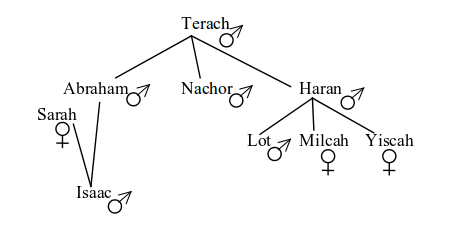

# Referencias

- (Blackburn, *et al.*, 2006, chap. 1) [^lpn]
- (Clocksin & Mellish, 2003, chap. 1) [^pip]
- Curso de Programación Lógica de la UPV/EHU [^prolog-ehu]
- Wikipedia: Prolog [^wiki]
- Wikipedia: Prolog Syntax and Semantics [^prolog-syntax]

# Prolog

Prolog (*programmation en logique*) es un lenguaje de programación basado en la lógica de predicados o lógica de primer orden. Como veremos, es un lenguaje principalmente **declarativo**. La manera habitual de utilizarlo consiste en expresar conocimiento en forma de relaciones, representadas como un conjunto de **hechos** y **reglas**, y lanzar **consultas** sobre estas relaciones.

Aunque se trata de un lenguaje de propósito general, habitualmente se asocia a áreas como la Inteligencia Artificial, la Lingüística Computacional (su objetivo original) y el desarrollo de sistemas expertos.


# Instrucciones

En Prolog existen tres tipos de instrucciones básicas: hechos (*facts*), reglas (*rules*) y consultas (*queries*). 

Programar en Prolog consiste principalmente en representar conocimiento a través de hechos y reglas ---diseñando **bases de conocimiento** (*knowledge bases*, KB)--- y en lanzar consultas acerca de la información almacenada en estas bases de conocimiento.

## Hechos

Los hechos son el tipo de sentencia más sencillo en Prolog. Todo hecho es una fórmula atómica con un predicado y una serie de términos y la forma $p(t_{1}, t_{2}... t_{n}).$. Este hecho se interpreta como que la relación expresada en el predicado se verifica sobre los términos.

La siguiente base de conocimiento contiene tres hechos distintos que representan, respectivamente, \textit{Sócrates es un hombre}, \textit{El jefe de gobierno de España es Rajoy} y \textit{La suma de 2 y 3 da como resultado 5}.

```prolog
/* kb1: ejemplo */
es_hombre(socrates).
jefe_de_gobierno(espana, rajoy).
suma(2, 3, 5).
```

A continuación se muestra el árbol genealógico de Abraham:



Podemos representar estas relaciones en la siguiente base de conocimiento:

```prolog
/* kb2: genealogía de  Abraham */
/* los hombres */
hombre(terach).
hombre(abraham).
hombre(isaac).
hombre(nachor).
hombre(haran).
hombre(lot).

/* las mujeres */
mujer(sarah).
mujer(milcah).
mujer(yiscah).

/* los padres */
padre(terach, abraham).
padre(terach, nachor).
padre(terach, haran).
padre(abraham, isaac).
padre(haran, lot).
padre(haran, milcah).
padre(haran, yiscah).
```

Una vez descrito este árbol genealógico, ¿cómo podemos utilizarlo? Pues lanzando consultas, es decir, haciendo preguntas al intérprete de Prolog acerca de las relaciones contenidas es esta base de conocimiento.\marginnote{No lo digo explícitamente, pero antes de preguntar nada es necesario cargar la base de conocimiento en SWI Prolog: \texttt{File > Consult}.}

*¿Es Terach un hombre?*

```prolog

?- hombre(terach).
true.
```

*¿Es Haran una mujer?*

```prolog

?- mujer(haran).
false.
```

*¿Es Abraham padre de Isaac?*

```prolog
padre(abraham, isaac).
true.
```


## Reglas

Las reglas se utilizan para declarar condiciones que son verdaderas en el dominio de interés. Las reglas tienen dos partes: una *cabeza*, que aparece a la izquierda del símbolo `:-`, y un *cuerpo* de la regla, que aparece a la derecha. La forma general es $A$ `:-` $B_{1}, B_{2}...B_{n}.$.

Modifiquemos\marginnote{Estas reglas están tratanto de representar, respectivamente \textit{Lot y Milcah son hermanos si Haran es el padre de Lot y Haran es el padre de Milcah}, y \textit{Milcah y Yiscah son hermanos si Haran es el padre de Milcah y Haran es el padre de Yiscah}. \newline Fíjate cómo expresamos estas reglas en Prolog. Para la condición $(\to)$ utilizamos el sómbolo \texttt{:-} y expresamos primero el consecuente y luego el antecedente. Y utilizamos el símbolo de la coma \texttt{,} para indicar conjunción $(\land)$ de predicados.} nuestra base de conocimiento anterior añadiendo varias reglas:

```prolog
/* definimos algunas relaciones entre hermanos */
hermanos(lot, milcah) :- 
  padre(haran, lot), 
  padre(haran, milcah).

hermanos(milcah, yiscah) :- 
  padre(haran, milcah), 
  padre(haran, yiscah).
```


A partir de este momento, podemos lanzar preguntas sobre las relaciones de hermanos

*¿Son hermanos Lot y Milcah?*

```prolog
?- hermanos(lot, milcah).
true.
```

¿Por qué es verdadera esta consulta? El intérprete de Prolog están utilizando *modus ponens*\marginnote{$((P \to Q) \land P) \to Q)$} para comprobar el valor de verdad de la regla. 


*¿Son hermanos Yiscah y Milcah?*

```prolog
?- hermanos(yiscah, milcah).
false.
```

¿Y por qué es falsa esta segunda consulta? A partir del conocimiento que tenemos almacenado y tal y como está definida esa regla, el antecedente no se cumple.


# Variables

Hasta ahora, las consultas de estos ejemplos son un poco aburridas. Únicamente estamos utilizando **hechos de base** para preguntar si determinadas consultas existen en la base de conociento. Sin embargo, pordemos lanzar consultas con variables:

```prolog
?- padre(abraham, X).
X = isaac.
```
En este caso estamos preguntando *¿Es Abraham padre de alguien?*. Fíjate cómo usamos la variable `X` para pedirle al intérprete que revise la base de conocimiento buscando hechos que den cuenta de la paternidad de Abraham. En este caso, existe un solo caso, y es el de Isaac. El intérprete *instancia* la variable `X` con el término `abraham` y nos lo muestra por pantalla.

Veamos otro ejemplo: *¿Cuántas mujeres hay?* en nuestra base de conocimiento.

```prolog
?- mujer(Persona).
Persona = sarah ;
Persona = milcah ;
Persona = yiscah.
```

En\marginnote{En Prolog, podemos introducir una variable simplemente asignando a un término una cadena cuyo primer carácter sea una letra mayúscula.} este caso, he utilizado la variable `Persona` para lanzar la consulta. 

El intérprete revisa el conjunto de hechos y reglas por orden, de arriba a abajo, buscando ejemplos de hechos válidos que encajen en la consulta. En nuestra base de conocimiento existen varios. El primero que encuentra instancia la variable `Persona` con `sarah`, y es el primero que muestra por pantalla. Si le pido que busque más ejemplos ---esto se consigue pulsando la barra espaciadora o el símbolo de punto y coma `;`--- seguirá recorriendo la base de conocimiento hasta que encuentre otro ejemplo válido y lo imprimirá por pantalla.

Otro ejemplos: *¿Cuántos hijos tiene Terach?*

```prolog
?- padre(terach, Hijo).
Hijo = abraham ;
Hijo = nachor ;
Hijo = haran.
```
*¿Quién es el padre de Lot?*

```prolog
?- padre(Padre, lot).
Padre = haran.
```

Nuestra base de conocimiento actual tiene definidos un par de reglas con hermanos, pero no es muy flexible. Podemos mejorar nuestra definición de hermano incluyendo reglas con variables. Es mucho más elegante y flexible: *dos personas son hermanas si tienen el mismo padre*:

```prolog
/* dos personas son hermanas si tienen el mismo padre */ 
hermanos(Hermano1, Hermano2) :- 
  padre(Padre, Hermano1), 
  padre(Padre, Hermano2).
```

Y podemos lanzar la siguiente consulta: *¿Quién es hermano de Abraham?*\marginnote{¿Ves algo raro? Fíjate en la primera opción que aparece.}


```prolog
hermanos(abraham, Hermano).
Hermano = abraham ;
Hermano = nachor ;
Hermano = haran.
```

# Términos

Hemos visto que Prolog maneja tres tipos diferentes de instrucciones: hechos, reglas y consultas. Hemos visto distintos ejemplos de estas instrucciones, y podemos intuir cuáles son los componentes de expresiones como `abraham`, `padre(terach, nachor)` o `Hijo`. Pues bien, todas estas intrucciones están compuestas de **términos**. Y en Prolog manejamos tres tipos de términos simples y términos complejos. Veamos cuales.

## Términos simples

1. Una **constante** o **átomo** puede ser:

    - una cadena formada por caracteres alfanuméricos y guiones bajos, siempre que comience por una letra minúscula: `abraham`, `es_Padre`, `m10rss4_b`.

    - una secuencia arbitraria de caracteres encerrada entre comillas simples: `'Carlos'`, `'El hijo del cura'`, `'~@%,'`.

    - una cadena de caracteres: `:-`, `;` y otros que veremos más adelante.


2. Prolog puede manejar **números** enteros (-3, 0, 12, 7335) y reales (-23.5, 0.00001, 3.1415924). Se representan tal cual, sin entrecomillar.

3. Una\marginnote{Más adelante conoceremos el uso de una variable especial llamada \textit{variable anónima} que representamos con un único guión bajo: \texttt{\_}.} **variable** es cualquier cadena formada por caracteres alfanuméricos y guiones bajos, siempre que comience por una letra mayúscula o un guión bajo: `X`, `Padre`, `_registro`, `_X23`. 


## Términos complejos

Los **términos complejos** o **estructuras** están formados por un funtor y una secuencia de argumentos. Como hemos visto en los ejemplos anteriores, los argumentos se encierran entre paréntesis y se separan con comas. Los funtores tiene que ser necesariamente átomos. Los argumentos, por otro lado, pueden ser cualquier tipo de término simple: átomos, números o variables.

`hermanos(abraham, Hermano)` es un término complejo que tiene un funtor (`hermanos`) y dos argumentos (`abraham` y `Hermano`). 

Vista la definición de término complejo, una estructura como la siguiente es perfectamente posible: 

```prolog
almacenar(Registro, libro(titulo('2001: A Space Odyssey'), 
  autor('Arthur C. Clarke'))).
```

El número de argumentos que acepta un término complejo se denomina **aridad**. En Prolog, es habitual definir los predicados indicando la aridad añadiendo `/n` al nombre del funtor.

Es importante tener en cuenta que un término complejo viene definido tanto por el funtor como por el número de argumentos, de manera que un programa en Prolog puede definir dos tipos de relaciones diferentes que tengan el mismo funtor. Por ejemplo, el siguiente código contiene dos predicados diferentes: `almacenar/1` y `almacenar/2`

```prolog
almacenar(registro1).
almacenar(registro1, ubicacion).
```

# Ejercicios

Hay que coger soltura con el intérprete y jugar en Prolog.

1. Extiende la base de conocimiento `kb2` añadiendo reglas que definan las relaciones *es hijo*, *es hija*, *es hermano*, *es hermana*, *es abuelo*, *es nieto*, *es nieta*.
2. Diseña una base de conocimiento con el árbol genealógico de los dioses olímpicos. [^dioses-olimpo] ¿Puedes reutilizar parte de la base de conocimiento anterior?


[^lpn]: Blackburn, P., Bos, J., Striegnitz, K. *Learn Prolog Now!*. College Publications. Texts in Computer Science, vol 7. 2006. http://www.learnprolognow.org/lpnpage.php?pageid=online

[^pip]: Clocksin, W., Mellish, C. S. *Programming in Prolog*. Springer Science & Business Media. 2003. http://books.google.es/books?id=VjHk2Cjrti8C

[^prolog-ehu]: Navarro, M. *Curso de Programación Lógica*. UPV/EHU. http://www.sc.ehu.es/jiwhehum2/prolog/Temario/Tema1.pdf

[^prolog-syntax]: http://en.wikipedia.org/wiki/Prolog_syntax_and_semantics

[^wiki]: https://en.wikipedia.org/wiki/Prolog

[^dioses-olimpo]: http://es.wikipedia.org/wiki/Anexo:%C3%81rbol_familiar_de_los_dioses_griegos