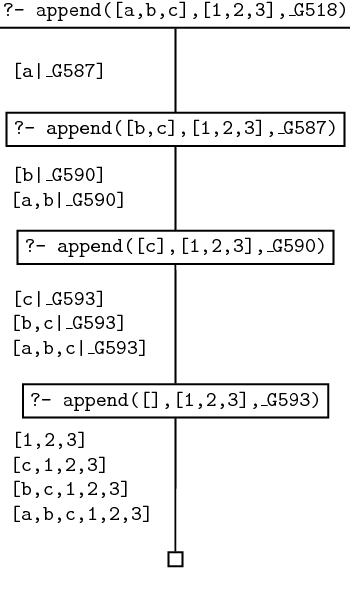

# Referencias

- (Blackburn, *et al.*, 2006, chap. 6) [^lpn]
- (Clocksin & Mellish, 2003) [^pip]


# Concatenando listas

Ya hemos visto cómo manejar listas y qué tipo de operaciones podemos realizar con ellas. En este tema vamos a profundizar un poco más en esta estructura de datos fundamental en Prolog.

Vamos a definir un predicado llamado `concatena/3` cuyos tres argumentos sean tres listas.

Desde el punto de vista declarativo, una consulta como `concatena(L1, L2, L3)` va a tener éxito si y solo si `L3` es una lista resultado de concatenar `L1` y `L2`. 

Consultas como las siguientes, tienen éxito:

```prolog
?- concatena([1, 2, 3], [4, 5, 6], [1, 2, 3, 4, 5, 6]).
true.

?- concatena([a, b], [c, [5, 6]], [a, b, c, [5, 6]]).
true.

?- concatena([a, b], [], [a, b]).
true.
```

Por el contrario, las siguientes consultas fallan:

```prolog
?- concatena([1, 2, 3], [4, 5, 6], [4, 5, 6, 1, 2, 3]).
false.

?- concatena([a, b], [c, [5, 6]], [a, b, c, 5, 6]).
false.

?- concatena([a, b], [], [a, b, []]).
false.
```

Desde el punto de vista procedimental, la utilidad más obvia de este predicado `concatena/3` es precisamente concatenar dos listas. Para ello, basta con que utilicemos una variable como tercer argumento:

```prolog
?- concatena([a, b], [1, 2, 3], Resultado).
Resultado = [a, b, 1, 2, 3].

?- concatena([1, 2, 3], [1, 2, 3], Resultado).
Resultado = [1, 2, 3, 1, 2, 3].

?- concatena([a, b], [], Resultado).
Resultado = [a, b].
```

Como veremos a continuación, también podemos usar `concatena/3` para cortar una lista en dos. De hecho, hay muchas cosas que podemos hacer con este predicado.

# Definiendo el predicado `concatena/3`

¿Cómo podemos definir este predicado? Fíjate en cómo lo definimos recursivamente:

```prolog
% predicado concatena/3
concatena([], L, L). 
concatena([Cabeza|Cola], L2, [Cabeza|L3]) :- concatena(Cola, L2, L3).
```

El caso base no debería ser ninguna sorpresa: la concatenación de la lista vacía con cualquier otra lista arbitraria da como resultado la lista en cuestión. Pero, ¿cómo tratamos la concatenación de una lista no vacía con otra lista L2? Pues separamos `Cabeza` y `Cola` en la primera lista y terminamos con una lista cuya cabeza es la `Cabeza` de la primera lista y cuya cola es el resultado de concatenar la `Cola` de la primera lista con la lista L2.

Analicemos el funcionamiento procedimental de este predicado. Fíjate en la traza de la consulta siguiente consulta:

```prolog
[trace]  ?- concatena([1, 2, 3], [4, 5, 6], L).
   Call: (6) concatena([1, 2, 3], [4, 5, 6], _G2774) ? creep
   Call: (7) concatena([2, 3], [4, 5, 6], _G2859) ? creep
   Call: (8) concatena([3], [4, 5, 6], _G2862) ? creep
   Call: (9) concatena([], [4, 5, 6], _G2865) ? creep
   Exit: (9) concatena([], [4, 5, 6], [4, 5, 6]) ? creep
   Exit: (8) concatena([3], [4, 5, 6], [3, 4, 5, 6]) ? creep
   Exit: (7) concatena([2, 3], [4, 5, 6], [2, 3, 4, 5, 6]) ? creep
   Exit: (6) concatena([1, 2, 3], [4, 5, 6], [1, 2, 3, 4, 5, 6]) ? creep
L = [1, 2, 3, 4, 5, 6].
```

El intérprete de Prolog recorre de manera recursiva la primera lista hasta que trata de concatenar una lista vacía y el caso base tiene éxito. A partir de ahí, recorre el camino inverso instanciando las variables que ha ido dejando por el camino.

Fíjate en el árbol de búsqueda de una consulta como `concatena([a, b, c], [1, 2, 3], X)`:




# Otros usos de `concatena/3`

Tal y como tenemos definido el predicado `concatena/3` podemos darle otros usos interesantes. El primero que vamos a ver es utilizarlo para romper una lista en dos. Fíjate en este ejemplo:

```prolog
?- concatena(L1, L2, [1, 2, 3, 4]).
L1 = [],
L2 = [1, 2, 3, 4] ;
L1 = [1],
L2 = [2, 3, 4] ;
L1 = [1, 2],
L2 = [3, 4] ;
L1 = [1, 2, 3],
L2 = [4] ;
L1 = [1, 2, 3, 4],
L2 = [] ;
false.
```

¿Cómo funciona esta consulta? Por un lado, especificamos la lista que queremos partir en dos como tercer argumento y, por otro, usamos dos variables como los dos pimeros argumentos. El intérprete de Prolog busca distintas posibilidades de instanciar las variables con dos listas cuya concatenación de como resultado la lista especificada como tercer argumento: en este caso, `[1, 2, 3, 4]`. Utilizando *backtracking*, Prolog es capaz de encontrar todas las posibilidades de separar una lista en dos.

```prolog
[trace]  ?- concatena(L1, L2, [a, b, c]).
   Call: (6) concatena(_G2763, _G2764, [a, b, c]) ? creep
   Exit: (6) concatena([], [a, b, c], [a, b, c]) ? creep
L1 = [],
L2 = [a, b, c] .

[trace]  ?- concatena(L1, L2, [a, b, c]).
   Call: (6) concatena(_G2763, _G2764, [a, b, c]) ? creep
   Exit: (6) concatena([], [a, b, c], [a, b, c]) ? creep
L1 = [],
L2 = [a, b, c] .

[trace]  ?- concatena(L1, L2, [a, b, c]).
   Call: (6) concatena(_G2763, _G2764, [a, b, c]) ? creep
   Exit: (6) concatena([], [a, b, c], [a, b, c]) ? creep
L1 = [],
L2 = [a, b, c] ;
   Redo: (6) concatena(_G2763, _G2764, [a, b, c]) ? creep
   Call: (7) concatena(_G2853, _G2764, [b, c]) ? creep
   Exit: (7) concatena([], [b, c], [b, c]) ? creep
   Exit: (6) concatena([a], [b, c], [a, b, c]) ? creep
L1 = [a],
L2 = [b, c] ;
   Redo: (7) concatena(_G2853, _G2764, [b, c]) ? creep
   Call: (8) concatena(_G2856, _G2764, [c]) ? creep
   Exit: (8) concatena([], [c], [c]) ? creep
   Exit: (7) concatena([b], [c], [b, c]) ? creep
   Exit: (6) concatena([a, b], [c], [a, b, c]) ? creep
L1 = [a, b],
L2 = [c] ;
   Redo: (8) concatena(_G2856, _G2764, [c]) ? creep
   Call: (9) concatena(_G2859, _G2764, []) ? creep
   Exit: (9) concatena([], [], []) ? creep
   Exit: (8) concatena([c], [], [c]) ? creep
   Exit: (7) concatena([b, c], [], [b, c]) ? creep
   Exit: (6) concatena([a, b, c], [], [a, b, c]) ? creep
L1 = [a, b, c],
L2 = [] 
   Redo: (9) concatena(_G2859, _G2764, []) ? creep
   Fail: (9) concatena(_G2859, _G2764, []) ? creep
   Fail: (8) concatena(_G2856, _G2764, [c]) ? creep
   Fail: (7) concatena(_G2853, _G2764, [b, c]) ? creep
   Fail: (6) concatena(_G2763, _G2764, [a, b, c]) ? creep
false.
```

Además, podemos utilizar `concatena/3` para definir otros predicados útiles. Imagina que necesitamos encontrar prefijos de listas (o sublistas que aparecen como cabeza de una lista mayor). Podemos definir un predicado `prefijo/2` tal que:

```prolog
% encuentra prefijos
prefijo(Prefijo, L) :- concatena(Prefijo, _, L).
```

La lista `Prefijo` es un prefijo de la lista `L` cuando existe alguna otra lista (representada por la variable anónima) que, concatenada con `Prefijo`, da como resultado la lista `L`. ¿Cómo funciona?

```prolog
?- prefijo(Prefijo, [z, y, x, w]).
Prefijo = [] ;
Prefijo = [z] ;
Prefijo = [z, y] ;
Prefijo = [z, y, x] ;
Prefijo = [z, y, x, w] ;
false.
```

Encuentra posibles *sufijos* para una lista y, lo que es más interesante, a través del *backtracking* es capaz de encontrar todas las posibles soluciones.

Podemos hacer algo similar y definir un predicado `sufijo/2` que busque posibles sufijos de una lista. La lista `Sufijo` es un sufijo de la lista `L` cuando existe alguna otra lista (representada por la variable anónima) de manera que si la concatenamos con `Sufijo`, da como resultado la lista `L`. 

```prolog
% encuentra sufijos
sufijo(Sufijo, L) :- concatena(_, Sufijo, L).
```

¿Cómo funciona?

```prolog
?- sufijo(Sufijo, [z, y, x, w]).
Sufijo = [z, y, x, w] ;
Sufijo = [y, x, w] ;
Sufijo = [x, w] ;
Sufijo = [w] ;
Sufijo = [] ;
false.
```

Por último, es sencillo definir un predicado `sublista/2` que encuentre sublistas a partir de listas mayores. Imagina la lista `[a, b, c, d]`. Podemos segmentarla en sublistas de elementos consecutivos tales como `[]`, `[a]`, `[b]`, `[c]`, `[d]`, `[a, b]`, `[b, c]`, `[c, d]`, `[a, b, c]`, `[b,c,d]` y la propia `[a, b, c, d]`. 

Podemos re-utilizar nuestro código anterior para definir una sublista como los prefijos de los sufijos de una lista.

```prolog
% una sublista es un prefijo de un sufijo de un lista
sublista(SubL, L) :- sufijo(Sufijo, L), prefijo(SubL, Sufijo). 
```

Y\marginnote{Fíjate en que tal y como está definido, repite algunos posibles soluciones. Prueba a visualizar la traza para terminar de entender su funcionamiento.} así es como funciona:

```prolog
?- sublista(SubL, [a, b, c]).
SubL = [] ;
SubL = [a] ;
SubL = [a, b] ;
SubL = [a, b, c] ;
SubL = [] ;
SubL = [b] ;
SubL = [b, c] ;
SubL = [] ;
SubL = [c] ;
SubL = [] ;
false.
```

# Problemas con `concatena/3`

Ya hemos visto que el predicado `concatena/3` tiene importantes usos y es muy práctico para algunas tareas relacionadas con dividir listas. Sin embargo, es algo ineficiente. Recuerda cómo funciona. Necesita recorrer de manera recursiva una lista completa hasta encontrar el caso base antes de realizar la concatenación de las listas propiamente dicha. No hay problema cuando estamos concatenando listas más o menos pequeñas. Pero, cuando lanzamos consultas con variables para que sea Prolog el que proporciona todas los posibles segmentos de una lista, vemos cómo se realizan demasiadas operaciones.

Para ilustrar este ejemplo de eficiencia, vamos a tratar de resolver el problema de invertir el orden de los elementos de una lista: vamos a definir un predicado `invierte/2` que tenga éxito cuando tome como primer argumento una lista (por ejemplo, `[1, 2, 3]` y como segundo la misma lista invertida `[3, 2, 1]`).


# Invirtiendo el orden de una lista

¿Para qué querríamos invertir el orden de una lista? ¿No es suficiente complicación con lo que llevaos visto hasta ahora? Bueno, como habrás visto, en Prolog es mucho más sencillo acceder a los primeros elementos de una lista (a tráves del operador `|` que separa cabeza y cola) que a los del final. Si tuviéramos un predicado que nos permitiera invertir el orden de los elementos de una lista, podríamos darle la vuelta a la lista y operar sobre la nueva cabeza. 

Vamos a definir dos mecanismos para invertir el orden de una lista. Primero una aproximación un poco ingenua, definida a partir de `concatena/3`. Después vamos a definir un mecanismo más eficiente, utilizando a nuestros amigos los *acumuladores*.


## Método 1: `invierte/2`

La definición recursiva de una lista invertida es la siguiente:

1. Si la lista de entrada es la lista vacía, la lista invertida es la misma lista vacía.
2. Si la lista de entrada es una lista no vacía, invertimos la cola de la lista y se la concatenamos a la cabeza de la lista.

```prolog
% invierte/2, v.1 
invierte([], []).
invierte([Cabeza|Cola], L) :- 
    invierte(Cola, ColaInvertida), 
    concatena(ColaInvertida, [Cabeza], L).
```
Para ver cómo funciona, considérese la lista `[1, 2, 3]`. Si invertimos la cola de la lista obtenemos `[3, 2]`. Y si le concatenamos `[1]`, obtenemos la lista invertida esperada: `[3, 2, 1]`.

¿Qué tal funciona?

```prolog
?- invierte([a, b, c], L).
L = [c, b, a].

?- invierte([primero, segundo, tercero], L).
L = [tercero, segundo, primero].
```

Esta definición es perfectamente correcta, pero si revisamos una traza veremos la cantidad de operaciones de concatenación que realiza.

```prolog
[trace]  ?- invierte([1, 2, 3], L).
   Call: (6) invierte([1, 2, 3], _G3077) ? creep
   Call: (7) invierte([2, 3], _G3159) ? creep
   Call: (8) invierte([3], _G3159) ? creep
   Call: (9) invierte([], _G3159) ? creep
   Exit: (9) invierte([], []) ? creep
   Call: (9) concatena([], [3], _G3163) ? creep
   Exit: (9) concatena([], [3], [3]) ? creep
   Exit: (8) invierte([3], [3]) ? creep
   Call: (8) concatena([3], [2], _G3166) ? creep
   Call: (9) concatena([], [2], _G3158) ? creep
   Exit: (9) concatena([], [2], [2]) ? creep
   Exit: (8) concatena([3], [2], [3, 2]) ? creep
   Exit: (7) invierte([2, 3], [3, 2]) ? creep
   Call: (7) concatena([3, 2], [1], _G3077) ? creep
   Call: (8) concatena([2], [1], _G3164) ? creep
   Call: (9) concatena([], [1], _G3167) ? creep
   Exit: (9) concatena([], [1], [1]) ? creep
   Exit: (8) concatena([2], [1], [2, 1]) ? creep
   Exit: (7) concatena([3, 2], [1], [3, 2, 1]) ? creep
   Exit: (6) invierte([1, 2, 3], [3, 2, 1]) ? creep
L = [3, 2, 1].
```

Siempre hay más de una forma de hacer las cosas. Y en este caso, hay una forma mejor.

## Método 2: `invierte2/3` usando acumuladores

La segunda forma de definir `invierte2/3` es utilizando acumuladores. La idea que subyace es sencilla: el acumulador es una lista que se inicializará como una lista vacía. A medida que vamos procesando las cabezas de la lista de partida, vamos añadiendo estos elementos al acumulador. El proceso termina cuando el acumulador contiene la lista inicial invertida.

Veamos\marginnote{Esta solución es eficiente porque simplemente recorremos la lista inicial una vez. No necesitamos perder tiempo realizando concatenaciones de segmentos de listas que resultan irrelevantes para generar el resultado final.} un ejemplo. Partimos desde la lista `[a, b, c]` y el acumulador es la lista vacía `[]`. Tomamos la cabeza de la lista cuyo orden queremos invertir y se lo añadimos al acumulador. A continuación, procedemos a invertir la cola de la lista `[b, c]`, siendo nuestro acumulador `[a]`. De nuevo, tomamos la cabeza, la añadimos como cabeza de nuestro acumulador, y procedemos a procesar la cola `[c]`, con el acumulador `[b, a]`. Añadimos la cabeza como cabeza del acumulador y procesamos la cola `[]` con el acumulador `[c, b, a]`. En este punto, el proceso termina, ya que la lista pendiente de procesar está vacía y, en consecuencia nuestro acumulador contiene la lista con el orden de los elementos invertidos.

El código necesario es el siguiente:\marginnote{Este es un ejemplo clásico de uso de acumuladores y es muy similar a los ejemplos que vimos en temas anteriores. La cláusula recursiva es la responsable de separar cabeza y cola de la lista de entrada y añadir la cabeza en el acumulador. El caso base detiene el proceso y \textit{copia} el contenido del acumulador en la lista invertida.}

```prolog
% invierte2/2 con acumulador
invierte2([Cabeza|Cola], Acumulador, LInv) :- 
    invierte2(Cola, [Cabeza|Acumulador], LInv).
invierte2([], Acumulador, Acumulador).
```

Veamos cómo funciona la traza.

```prolog
[trace]  ?- invierte2([1, 2, 3], [], L).
   Call: (6) invierte2([1, 2, 3], [], _G3062) ? creep
   Call: (7) invierte2([2, 3], [1], _G3062) ? creep
   Call: (8) invierte2([3], [2, 1], _G3062) ? creep
   Call: (9) invierte2([], [3, 2, 1], _G3062) ? creep
   Exit: (9) invierte2([], [3, 2, 1], [3, 2, 1]) ? creep
   Exit: (8) invierte2([3], [2, 1], [3, 2, 1]) ? creep
   Exit: (7) invierte2([2, 3], [1], [3, 2, 1]) ? creep
   Exit: (6) invierte2([1, 2, 3], [], [3, 2, 1]) ? creep
L = [3, 2, 1].
```

Por\marginnote{Es muy instructivo ejecutar trazas de las dos variantes. Compara las consultas \texttt{invierte([1, 2, 3], L)} y \texttt{invierte2([1, 2, 3], [], L)}, por ejemplo.} comodidad, podemos crear un predicado extra que llame a `invierte2/2` inicializando el acumulador.

```prolog
invierte2(Lista, LInv):-  invierte2(Lista, [], LInv.
```


# Ejercicios

1. Otros ejercicios. [^ejercicios]

2. La sesión práctica. [^practica]


[^lpn]: Blackburn, P., Bos, J., Striegnitz, K. *Learn Prolog Now!*. College Publications. Texts in Computer Science, vol 7. 2006. http://www.learnprolognow.org/lpnpage.php?pageid=online

[^pip]: Clocksin, W., Mellish, C. S. *Programming in Prolog*. Springer Science & Business Media. 2003. http://books.google.es/books?id=VjHk2Cjrti8C

[^prolog-ehu]: Navarro, M. *Curso de Programación Lógica*. Tema 1. UPV/EHU. http://www.sc.ehu.es/jiwhehum2/prolog/Temario/Tema1.pdf

[^recursion-ehu]: Navarro, M. *Curso de Programación Lógica*. Tema 2. UPV/EHU. http://www.sc.ehu.es/jiwhehum2/prolog/Temario/Tema2.pdf

[^prolog-syntax]: http://en.wikipedia.org/wiki/Prolog_syntax_and_semantics

[^wiki]: https://en.wikipedia.org/wiki/Prolog

[^ejercicios]: http://www.learnprolognow.org/lpnpage.php?pagetype=html&pageid=lpn-htmlse26

[^practica]: http://www.learnprolognow.org/lpnpage.php?pagetype=html&pageid=lpn-htmlse27
